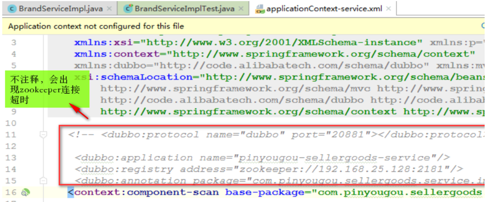
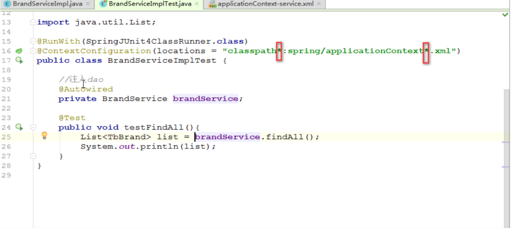
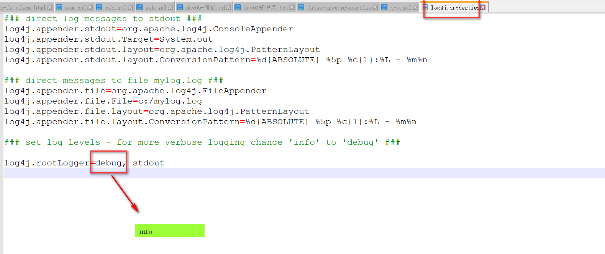

### 2019-06-27-课堂内容

# 1.补充-基本功

* 抽象能力
*  编码规范
  * 加注释
  * 写代码逐行测试
* 日志记录
* linux记录
  * 使用命令
* uml图：类图，时序图，E-R图，...

# 2.回顾

* 电商基本知识
  * 模式
    * B2C：企业对个人
    * B2B：企业对企业
    * B2B2C：平台对企业对个人
    * O2O：线上对线下 线上支付，线下体验

***

* dubbo
  * 基于soa架构的分布式框架
    * soa：面向服务的架构是一个组件模型，它将应用程序的不同功能单元（成为服务）进行称拆分。
  * Zookeeper：注册中心
  * 架构
    * 注册中心：
    * 服务提供方：
    * 服务消费方：

+++

* 项目结构（**被依赖的项目必须是jar工程，pom文件中的依赖**）

# 3.课堂内容

## 3.1 项目搭建

* 软件下载
  
* postman：测试http发送各种方式请求的软件
  
* 测试注意事项
  
  * > 

> 	
>
> * 添加日志文件
>
> 

## 3.2 AnguLarJs

* 简介
  * 前端框架思想分类
    * dom
    * mvvm
  * 四大特性
    * mvc模式
    * 双向数据绑定
    * 模块化
    * 依赖注入
  * 指定

# 4 需要回顾的遗忘知识

* git的使用

  * 两种方式：ssh，https

    

    

