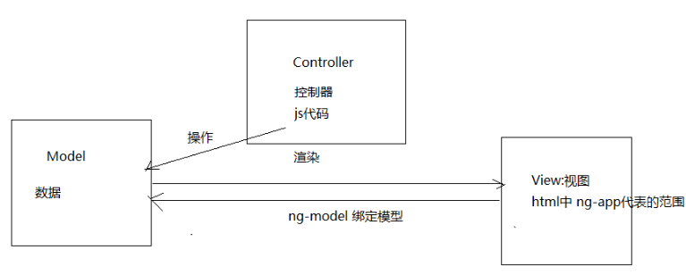

# AngularJs 简单学习

## 1. AnularJs和JQuery的区别

* jQuery是以DOM操作为核心，而AngularJS则是以数据和逻辑为核心，这是它们本质上的区别

## 2. 四大特征

* MVC：前端的MVC

  * Model：数据
  * View：数据的呈现，ng-app（通常是放在html的body标签中）
  * Controller：操作数据，function

* 双向数据绑定

  >   ​	AngularJS 是建立在这样的信念上的：即声明式编程应该用于构建用户界面以及编写软件构建，而指令式编程非常适合来表示业务逻辑。框架采用并扩展了传统 HTML，通过双向的数据绑定来适应动态内容，双向的数据绑定允许模型和视图之间的自动同步。因此，AngularJS 使得对 DOM 的操作不再重要并提升了可测试性。
  >
  >   

* 依赖注入

  >    ​	依赖注入(Dependency Injection,简称 DI)是一种设计模式, 指某个对象依赖的其他对象无需手工创建，只需要“吼一嗓子”，则此对象在创建时，其依赖的对象由框架来自动创建并注入进来,其实就是最少知识法则;模块中所有的 service 和 provider 两类对象，都可以根据形参名称实现 DI.

  >    例如：$scope、$http

* 模块化设计
  
  * ng：核心模块

## 3. 入门案例

> 常见的指令：
>
> - ng-app:定义模块的
>
> - ng-model:数据绑定
>
> - ng-init:初始化 相当于之前的 $(function(){})
>
> - ng-click:单击事件
>
> - ng-repeat:循环遍历
>
>     - ng-repeat="变量  in 数组对象":循环遍历对象数组/集合
>
>     ​	{{变量}}

### 3.1 demo01-表达式、开启angularJs引擎

* 表达式{{}}
* ng-app：常见的指令之一。
  * 位置：加到body标签上
  * 作用：开启angularJs引擎

### 3.2 demo02-双向绑定

* ng-model: 数据绑定，这样用户在文本框输入的内容会绑定到变量上，而表达式可以实时地输出变量。

### 3.3 demo03-初始化指令

* ng-init：初始化变量值

### 3.4 demo04-控制器

* 定义模块：<font color="red">一个模块中可以多个控制器</font>

  ```javascript
  //Controller:控制层
  
  //定义了一个叫 myApp 的模块,[]中放的是其他模块名（当引用到其他模块的时候）
  var app=angular.module("模块名称",["需要引用的模块名称"]); 
  //创建控制器
  app.controller("控制器名称",function(){
      
      
  })
  
  //View:视图层
  //ng-app：注意此处引用模块，开启AngularJs引擎，ng-Controller指定控制器
  <body ng-app="myApp"  ng-controller="add">
      
      //Model:数据访问层，通过：ng-model绑定变量
              
      param1:<input type="text" ng-model="x">
      <br>
      param2:<input type="text" ng-model="y">
      <br>
      <!--调用控制器-->
      {{add()}}
  </body>
  ```
  
    > ​	$scope 的使用贯穿整个 AngularJS App 应用,它与数据模型相关联,同时也是表达式<font color='red'>{{}}</font>执行的上下文.有了$scope 就在视图和控制器之间建立了一个通道,基于作用域视图在修改数据时会立刻更新 $scope,同样的$scope 发生改变时也会立刻重新渲染视图.

### 3.5 事件指令

* ```
  ng-click="方法名"
  ```

* 定义变量，可以在Controller：控制层直接定义，绑定数据，而在view：视图层则需要使用ng-model进行数据绑定

   ```javascript
    <script>
            <!--定义模块-->
            var app = angular.module("myApp",[]);
            //定义控制器
            app.controller("add",function ($scope) {
                $scope.add = function () {
                    //在Controller层中的绑定数据
                    $scope.z =  $scope.x + $scope.y;
    
                };
    
            }) ;
    
        </script>
   ```

### 3.6 循环数组

* 语法

  ```javascript
    ng-repeat = "变量名 in 容器";
  ```

* 代码示例

  ```javascript
  <head>
      <meta charset="UTF-8">
      <title>Title</title>
      <script src = angularjs/angular.min.js></script>
      <script>
          //定义模块
          var app = angular.module("myModule",[]);
          //定义控制器
          app.controller("list",function ($scope) {
              //在Controller层绑定数据
              $scope.list = [1,2,3,4];
  
          });
      </script>
  </head>
  <body ng-app="myModule" ng-controller="list">
  <table>
      //具体将ng-repeat放在何处，取决于展示谁
      <tr ng-repeat="var01 in list">
          <td>{{var01}}</td>
      </tr>
  </table>
  </body>
  ```


### 3.6 循环对象数组

* 语法 

  ```javascript
  ng-repeat
  ```

* 用法
  
  * 同数组大同小异，就是循环json格式的对象数组

### 3.7 内置服务

* 语法

  ```javascript
  $http//使用依赖注入的思想DI
  ```

* 作用

  * 从后端获取数据

* 代码示例

  ```javascript
  //Q1: 这个模仿后台数据的文件是否可以写成.text或者.properties文件中呢，效果一样吗？
  //A1: 不可以，.json格式文件是必须的，是一种必须的文件格式
  ```

* <font color="red">注意事项</font>
  * 在Controller层中定义控制器-并且给$scope绑定方法的时候，注意绑定变量、绑定方法的格式是：

    ```javascript
    //定义变量
    $scope.var = ...;
    //定义方法
    $scope.方法名 = function(
    	//在方法中发送ajax请求
    	$http.get("请求的地址").success(function(response){//function回调函数
        	 $.scope.容器名 = response;                        
                                  
       	});
    
    );
    ```

    