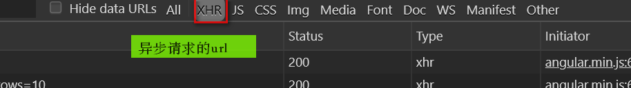

# 2019-07-01

## 1. 问题汇总

> * @Reference注解的属性 timeout :设置接收到远程服务Service的超时时间。
>
> * 使用select2控件，在input标签中需要必须添加的属性
>
>   * <font color="red">select2,select2-model(绑定数据),config(设置数据来源),mutiple(设置其为多选框，不写该属性默认单选）</font>
>
>   ```javascript
>   <input select2 select2-model="entity.brandIds" config="brandList" multiple class="form-control"/>
>   ```
>
> * 字符串转为Json（前端）
>
>   * eval:'(' '）'包裹
>   * JSON.parse
>
> * java的Map类型转为json格式的字符串是什么样子？
>
>   * map类型对应的数据库中的一行中的键值对对象
>   * list类型对应的是数据库中的多个对象的集合
>
> * date、data单词写混了，导致json字符串对象，赋值给下拉框失败
>
> * 浏览器抓包的时候filter中XHR指的是
>
>   
>
> * json对象的遍历
>
>   ```javascript
>   $scope.jsonToString = function (jsonPatternStr, key) {
>       var jsonPattern = JSON.parse(jsonPatternStr);
>       value = "";
>       for (var i = 0; i < jsonPattern.length; i++) {
>           for (var jsonPatternKey in jsonPattern[i]) {
>               if (jsonPatternKey == key) {
>                   value += jsonPattern[i][key] + ",";
>               }
>           }
>       }
>       return value;
>   }
>   ```
>
>   

