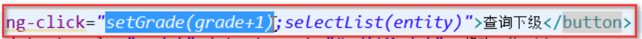
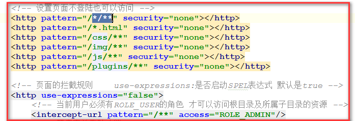

# 商品录入

> * 完成商品分类功能
> * 了解电商概念 SPU 和 SKU
> * 掌握富文本编辑器的使用
> * 掌握上传服务器 FastDFS（后端）
> * 掌握 angularJS 图片上传（前端）

## 1. 问题汇总

> * javascript中标签中绑定多个方法，用;分割
>
>   
>
> * 前端的访问路径必须加.do后缀！！！！

## 2. 商品分类管理

### 2.1 表结构

* tb_item_cat：自关联--->实现三级分类

### 2.2 列表实现

* 后端实现

  * 此处的查询只能通过查询tb_item_cat表的parent_id来实现，parent_id分别是0,1,2.

  * 测试

    * 方便测试，设置spring-security.xml配置文件

      

    * 使用postman发送请求，itemCat/findByParentId.do?parentId=0

* 前端实现（尝试分页）

  * itemService.js
  * itemController.js
  * 前端页面引入js文件
  * 页面绑定数据
  * angular指令ng-if，相当于if，当点到三级的时候隐藏查询下级按钮
  * 面包屑导航
    * ng-bind指令