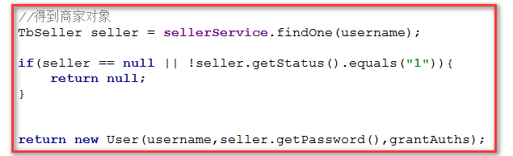

# 商家系统登录与安全控制

## 1. <font color="red">问题汇总</font>

> * 在三层架构中，web/controller层中的接口上url地址加不加后缀.do,前端的访问后端接口都必须加.do，spring框架默认会给controller层的接口加.do路径
>
> * mapper.xml配置文件中的selectKey标签，<font color="red">注意selectKey中属性order="AFTER",指的是在执行insert之后执行selectKey</font>
>
>   ```xml
>   <insert id="insert" parameterType="com.pinyougou.pojo.TbSpecification"> 
>       <selectKey resultType="java.lang.Long" order="AFTER" keyProperty="id">      
>      	 SELECT LAST_INSERT_ID() AS id    
>       </selectKey>  
>       insert into tb_specification (id, spec_name)    
>       values (#{id,jdbcType=BIGINT}, #{specName,jdbcType=VARCHAR})
>   </insert>
>   ```
>
> * 认证类调用服务方法
>
>   * spring-security.xml中的配置信息分析
>     1. 导入dubbo的命名空间，约束头（两个）
>     2. 
>
> * 给成员变量赋值的三种方式
>
>   * 构造方法
>   * 成员函数赋值 setter方法
>   * 暴力反射
>
> * MD5加密后的32（位）字符串是固定的，而spring security提供加密Bcrypt算法得出的字符串（60位）是不固定的，因为Bcrypt使用的是随机盐值（salt）
>
> * XHR：AJax请求创建的对象 XMLHttpRequest
>
> * <font color="red">报错的时候，从后往前找caused by,复制错误的时候赋值后面的内容，进行关键字搜索</font>


## 2. 课堂内容

### 2.1 认证类调用服务方法

* 由于是远程调用SellerService服务中的方法，所以需要将SellerService对象进行注入
  * 声明成员变量
  * 定义setter方法

* 改变UserDetailsServiceImpl实现类中loadByUsername（）方法的逻辑-->根据username从数据库中查询用户信息

  * 判断返回的用户对象是否存在（null），存在

    * 则判断用户信息中status是否为1，为1则对UserDetails的实现类User进行数据封装返回

      

* spring-security.xml中的配置信息

  1. 导入dubbo的命名空间，约束头（两个）
  2. 声明对应的接口，从dubbo中抓取（服务提供的）接口的实现类

  ```xml
  <dubbo:reference id="sellerService"interface="com.pinyougou.sellergoods.service.SellerService"></dubbo:reference>
  ```

  3. 将sellerService的实现类注入到userDetailService对象的成员方法中！！！<font color="red">使用非注解的方式对成员变量进行对象注入</font>>

  ```xml
  <beans:bean id="userDetailService" class="com.pinyougou.shop.service.UserDetailsServiceImpl">
  	<beans:property name="sellerService" ref="sellerService"/>
  </beans:bean>
  ```

  4. 测试

  * 测试1:不正确的用户名,正确的密码是否可以登录
  * 测试2：测试status不为1的是否可以登录

### 2.2 商家入驻密码加密（使用BCrypt算法（对md5加密的封装）、md5加密）

1. 在pinyougou-shop-web模块下的SellerController类下的add方法对前台传递的商家信息的密码进行加密，并将加密后的方法放到对象中（setter）

   ```java
   BCryptPasswordEncoderpasswordEncoder = new BCryptPasswordEncoder();
   String password = passwordEncoder.encode(seller.getPassword());
   seller.setPassword(password);
   ```

2. 修改商家注册信息：数据库中的status字段为1

3. spring-security.xml配置文件

   ```xml
   <beans:bean id="bcryptEncoder" class="org.springframework.security.crypto.bcrypt.BCryptPasswordEncoder"/>
   <!--认证-->
   <authentication-manager>
       <authentication-provider user-service-ref="userDetailService">
           <password-encoder ref="bcryptEncoder"></password-encoder>
       </authentication-provider>
   </authentication-manager>
   ```

4. 测试，数据库中status字段为1，且密码经过加密的商家，尝试登录

### 2.3 显示登录名

```java
String name=SecurityContextHolder.getContext().getAuthentication().getName();
```

### 2.4 注销操作，退出登录

* 访问/logout地址


