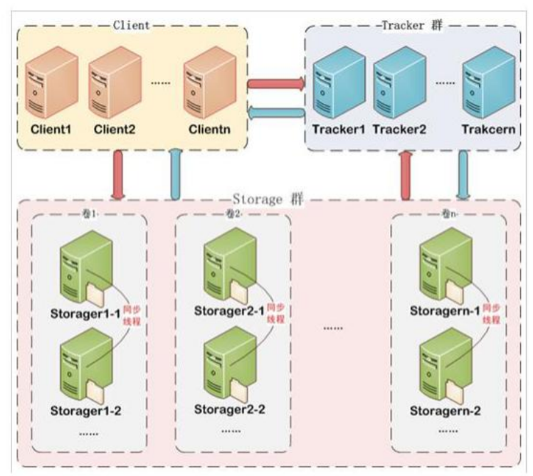
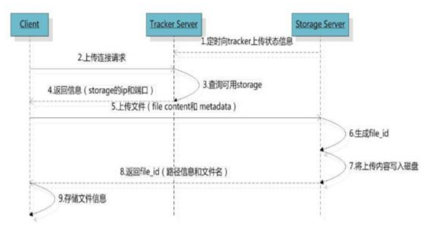
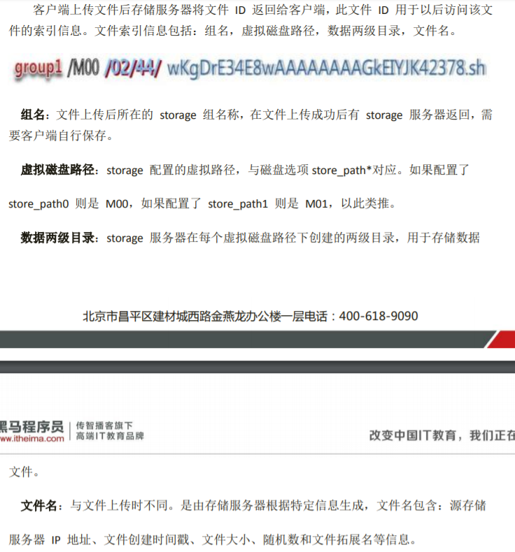

# 分布式文件服务器FastDFS

## 1. 简介

> * 什么是FastDFS
>
>   * FastDFS 是用 c 语言编写的一款开源的分布式文件系统。FastDFS 为互联网量身定制，充分考虑了冗余备份、负载均衡、线性扩容等机制，并注重高可用、高性能等指标，使用FastDFS 很容易搭建一套高性能的文件服务器集群提供文件上传、下载等服务。
>
> * FastDFS结构
>
>   * FastDFS 架构包括 Tracker server 和 Storage server。客户端请求 Tracker server 进行文	件上传、下载，通过 Tracker server 调度最终由 Storage server 完成文件上传和下载。
>
>     * Tracker server
>       * 作用是负载均衡和调度，通过 Tracker server 在文件上传时可以根据一些策略找到 Storage server 提供文件上传服务。可以将 tracker 称为追踪服务器或调度服务器。
>     * Storage server
>       * 作用是文件存储，客户端上传的文件最终存储在 Storage 服务器上，Storageserver 没有实现自己的文件系统而是利用操作系统的文件系统来管理文件。可以将storage 称为存储服务器。
>
>   * 执行过程
>
>     
>
>     
>
>     

​	