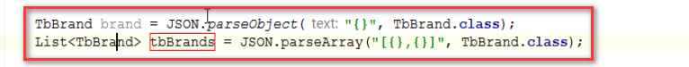

# 商品录入02

## 1. 问题汇总

* zk的作用就是提供地址，他会在消费者端提供地址的缓存表，提高效率
* 一二三级下拉框，
  * 做判断，当页面加载发送多个无用的请求，判断undifined
  * 下拉框bug，当改变1,2改变，但是3没有清空
* new Long(),new Interger(),....
* 注意在js文件中定义变量的时候，通常都是要进行数据绑定的！！，别忘记$scope
* 做类型强转的时候要注意强制类型转换的格式是:(目标类型)变量
* ng-repeat 指令不仅仅只能用于遍历表格，div等都可以

## 2. 商家-选择商品分类

* 单选下拉列表的实现（使用原生的select，使用ng-option指令），可以尝试使用select2做一下
* fastJson常用的方法：
  * 类方法：
    * parseObject("json格式的对象",该对象的字节码文件对象);
    * parseArray("json格式的数组"，数组中存储对象的字节码类型);
* JavaScript中使用var定义变量，如：for(var i = 0;i<10;i++){ ... },在此循环外依旧可以访问到i的值，所以一般使用let关键字定义变量比较合适

## 3. 商家-品牌选择
