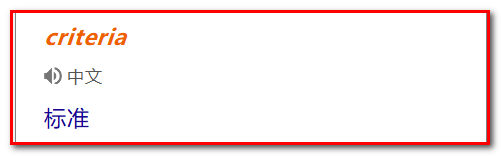
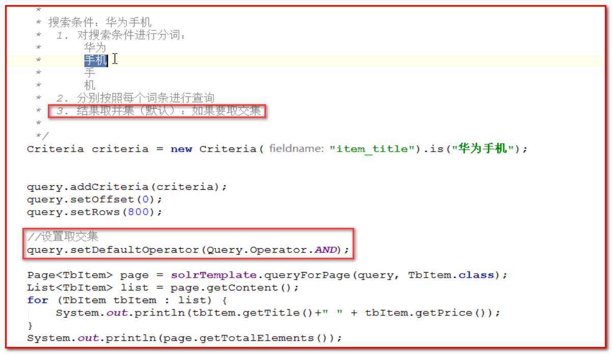

## 1. 配置域-复制域

* 复制域的作用在于将某一个 Field 中的数据复制到另一个域中

## 2. spring data solr

### 2.1 简介

---

* 我们如何将Solr 的应用集成到 Spring 中？可以，Spring Data Solr 就是为了方便 Solr 的开发所研制的一个框架，其底层是对 SolrJ（官方 API）的封装。
* solrj：官方类库，实现对solr的增删改查
  * 原理：http请求和响应
  * httpClient:可以手动请求solr，手动处理响应

### 2.2 入门demo

---

1. 创建maven工程
2. 在pom文件中导入依赖
   * spring-data-solr
   * spring-test
   * junit
3. 在resource下导入applicationContext-solr.xml配置文件
   * solr-server
   * solrTemplate

4. @Field注解
   * 拷贝TbItem pojo，并配置注解，若域名和属性名相同则直接使用@Field，否则@Field需要带参数如：@Field("item_title")

---

5. 增加操作
   * 启动tomcat-solr，配置域之后要重启tomcat-solr
   * 根据id来标识，若id相同去执行saveBean(...)方法则表示修改操作
   * 提交数据commit();
6. 按照主键查找、删除操作
   * getById(...)
   * deleteById(...)
   * 提交数据commit();
7. 批量数据的增加,循环插入 100 条测试数据
   * saveBeans(...集合)
   * 提交数据commit();

8. 分页查询

   * queryForPage(Query query,Class<T> clazz)	

   * 创建Query接口的实现类，SimpleQuery("查询的表达式");
     * 不设置开始的索引，默认是从0开始，并且rows = 10显示十条记录，setOffset(...)
     * 设置rows,setRows();
   * 循环输出分页内容，getCOntent();
   * 获取总条目数：getTotalElements();
   * 获取总页数：getTotalPages();

9. 条件查询

   * Criteria 用于对条件的封装：

     

     

   * pinyin4J：作用：拼音转汉字
   * is(value)方法：表示匹配词条，词条是value

10. 删除全部数据

    * delete(Query query);
    * 提交数据commit();

### 2.3 批量数据导入（真实数据）

---

* 编写专门的导入程序，将商品数据导入Solr系统中
* 步骤
  * 创建maven工程（jar），且是父子工程
  * 修改pom文件，引入spring相关的依赖和pinyougou-dao依赖
  * 创建配置文件
    * 内容:包扫描
  * 代码编写
    * ==编写的时候，使用需要什么创建什么的方式编写代码，不要"背诵"代码。==
      1. 查询商品数据列表
      2. 数据导入Solr索引库--->普通字段,commit();
      3. 动态域，规格属性导入Solr索引库
         * 使用Map集合+@Dynamic注解
         * commit();

## 3. 品优购-关键字搜索

### 3.2 准备工作

---

* 创建接口层
  * 创建 pinyougou-search-interface 模块,==并且导入pinyougou-pojo依赖==
    * 创建 com.pinyougou.search.service 包

