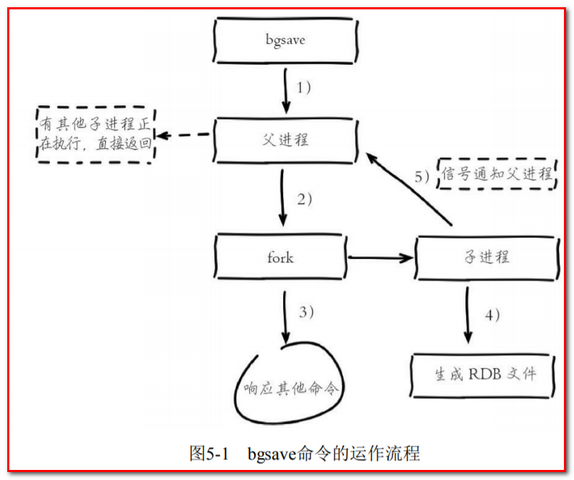

# Redis

## 1. 持久化

>​	Redis支持RDB和AOF两种持久化机制，持久化功能有效地避免因进程退出造成的数据丢失问题，当下次重启时利用之前持久化的文件即可实现数据恢复。
>
>​	持久化章节的内容：
>
>* 介绍RDB、AOF的配置和运行流程，以及控制持久化的相关命令
>  * bgsave
>  * bgrewriteaof
>* 对常见的持久化问题进行分析定位和优化
>* 结合Redis常见的单击多实例部署场景进行优化

### 1.1 RDB

   定义：RDB(redis database)持久化是把当前进程数据生成==快照==保存到硬盘的过程中，触发RDB持久化过程分为==手动触发==和==自动触发==

#### 1.1.1 触发机制

* 手动触发分为save和bgsave命令:
  * save命令：阻塞当前Redis服务器，直到RDB过程完成为止
  * bgsave命令：Redis进程执行fork操作创建子进程，RDB持久化过程由子进程负责，完成后自动
  * ==显然bgsave命令是对save阻塞问题作出的优化，Redis内部所有涉及RDB的操作都采用bgsave的方式，save命令已经被废弃==

  > 补充：
  >
  > * java中线程的生命周期分为5种状态：
  >   * 新建:新创建了一个线程对象
  >   * 可运行(runnable):线程对象创建后，其他线程(比如main线程）调用了该对象的start()方法。该状态的线程位于可运行线程池中，等待被线程调度选中，获取cpu 的使用权 。
  >   * 运行(running):可运行状态(runnable)的线程获得了cpu 时间片（timeslice） ，执行程序代码。
  >   * 阻塞:阻塞状态是指线程因为某种原因放弃了cpu 使用权，也即让出了cpu timeslice，暂时停止运行。直到线程进入可运行(runnable)状态，才有机会再次获得cpu timeslice 转到运行(running)状态。阻塞的情况分三种：
  >     * 等待阻塞
  >     * 同步阻塞
  >     * 其他阻塞
  >   * 死亡：线程run()、main() 方法执行结束，或者因异常退出了run()方法，则该线程结束生命周期。死亡的线程不可再次复生。

* Redis内部的自动触发RDB的持久化机制，场景如下

  * 使用save相关配置，如"save m n"。表示==m秒内 数据集 存在n次修改时，自动触发bgsave==。

  * 如果从节点执行全量复制操作，主节点自动执行bgsave生成RDB文件并发送给从节点
  * 执行debug reload命令重新加载Redis时，也会自动触发save操作
  * 默认情况下执行shutdown命令时，如果没有开启AOF持久化功能则自动执行bgsave命令。

  > 补充：
  >
  > * 节点：一个Redis集群通常由多个节点组成，使用CLUSTER MEET命令来完成节点间的连接
  >
  > * redis集群每个节点有一主一备：
  >   * 主备：指的是通常情况下主机运行，备份机不工作，当主机挂掉，备份机可以代替继续工作
  >   * 主从：指的是主机在运行的情况下，从机也会运行工作，当主机挂掉，从机会接替主机继续工作
  >
  > 

#### 1.1.2 流程说明

* 流程分析

  1. 执行bgsave命令，Redis父进程判断当前是否存在正在执行的子进程，如RDB/AOF进程，如果存在则直接返回

  2. 父进程==执行fork操作创建子进程==，fork操作过程中父进程会阻塞

  3. 父进程fork完成后，不再阻塞父进程，可以继续响应其他命令

  4. 子进程创建RDB文件，根据父进程内存生成临时快照文件，王城后对原有文件进行原子替换

  5. 进行发送信号给父进程表示完成，父进程更新统计信息

#### 1.1.3 RDB的优缺点

* 优点
  * Redis加载RDB恢复数据远远快于AOF的方式。
* 缺点
  * RDB方式数据没办法做到==实时持久化/秒级持久化==。因为bgsave每次运行都要执行fork操作创建子进程，属于重量级操作，频繁执行成本过高。
* 改进方案：
  * ==针对RDB不适合实时持久化的问题，Redis提供了AOF持久化方式来解决。==

### 1.2 AOF

​	定义：AOF（append only file）持久化，==以独立日志的方式记录每次命令，重启时再重新执行AOF文件中命令达到恢复数据的目的==，AOF主要解决了==RDB不能实时持久化的问题==。

